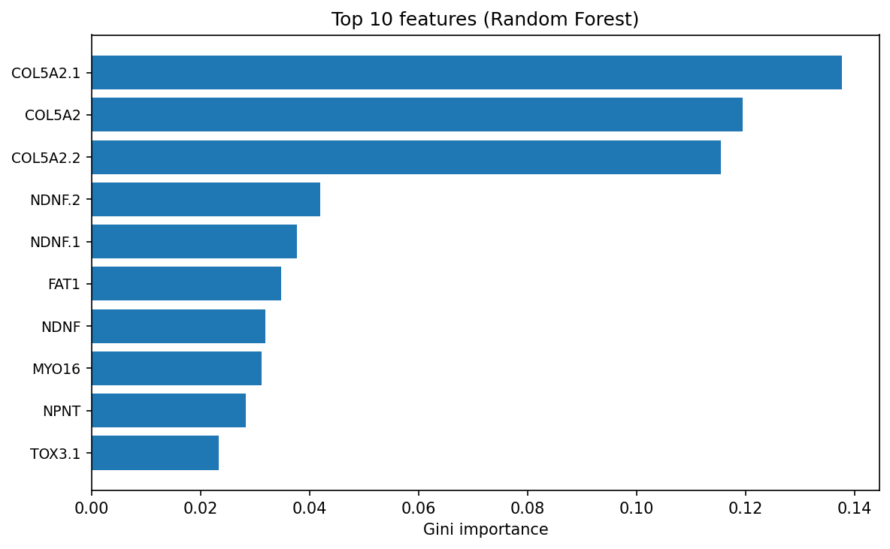

# HW 2 Random Forest ML Pipeline

**CSC 695 / 895 Spring 2026**  
**Instructor:** D. Petkovic  
**Author:** Omeid Nadery  
**Date:** 3/13/2026

---

## 1. Audit of Original Database

The original dataset has 871 samples and 609 columns. One column is the label and the rest are gene expression features, so there are 608 features. There are two classes, with label 1 for the i1 neuron cluster and label 0 for non-i1. The dataset is unbalanced, with most samples in class 0, about 90%, and about 10% in class 1. All feature columns are numeric. The notebook audit checks for missing values and none were reported. No columns were flagged as potentially personally identifying (e.g. no "id", "name", or "patient" in column names). The source file is Original training DB i1 cluster.csv.

The number of samples (871) is below the standard of 10 times the number of features (608), so the dataset is high-dimensional relative to sample size. Cross-validation and OOB evaluation are used to assess performance without relying on a single train/test split.

**Table 1. Original dataset statistics**

| Statistic           | Value                              |
|--------------------|-------------------------------------|
| Number of samples  | 871                                 |
| Number of features | 608                                 |
| Number of classes  | 2                                   |
| Class 0 (non-i1)   | 781                                 |
| Class 1 (i1)       | 90                                  |
| Feature types      | Numeric                             |
| Missing values     | 0                                   |
| Dataset source     | Original training DB i1 cluster.csv |

---

## 2. Creation of Training DB and Verification DB

Two random samples were removed to form the verification set, one with class 1 and one with class 0, so the verification set has two samples (one per class). Holding out one sample per class ensures that the verification set is balanced and that we can check the model on both i1 and non-i1 examples. The training set is the original dataset minus these two samples, so it has 869 samples. The same random seed (42) was used so the split is reproducible.

**Table 2. Training dataset statistics**

| Statistic           | Value |
|--------------------|-------|
| Number of samples  | 869   |
| Number of features | 608   |
| Class 0 count      | 780   |
| Class 1 count      | 89    |

**Table 3. Verification dataset statistics**

| Statistic           | Value |
|--------------------|-------|
| Number of samples  | 2     |
| Class 0 count      | 1     |
| Class 1 count      | 1     |

---

## 3. Software Tools

- **Python** – Runtime and scripting.
- **Jupyter Notebook** – Interactive workflow and documentation.
- **scikit-learn** – RandomForestClassifier for training, StratifiedKFold for fold indices, and metrics (confusion matrix, accuracy, precision, recall, F1).
- **pandas** – Loading CSV data, building tables, and saving outputs.
- **NumPy** – Numerical arrays and random state handling.
- **matplotlib / seaborn** – Top-10 feature importance plot (saved as reports/figures/top10_features.png).

---

## 4. Experimental Methods and Setup

**Method 1, Random Forest with OOB estimation.** Out-of-bag (OOB) estimation uses the fact that each tree in the forest is trained on a bootstrap sample of the data, so about one-third of the training samples are OOB for each tree. Those samples get predictions from the trees that did not use them, giving an internal validation estimate without a separate holdout set. A grid search was run over n_estimators (200, 500, 1000), max_features ("sqrt", "log2", 0.1, 0.2), and min_samples_leaf (1, 2, 5). Each model used RandomForestClassifier with bootstrap=True and oob_score=True. OOB predictions were taken from the out-of-bag decision function and thresholded at 0.5 to get predicted classes. From those, confusion matrix, accuracy, precision, recall, and F1 were computed. The best model was chosen by highest F1 because the dataset is imbalanced (few i1 samples). F1 balances precision and recall and is more informative than accuracy when the positive class is rare.

**Method 2, Manual 3-fold cross-validation.** This method gives an estimate of how the model generalizes to unseen data by training on two-thirds of the data and evaluating on the remaining third, repeated three times so each sample is in the test set exactly once. StratifiedKFold with 3 splits and a fixed random state was used only to get train and test indices (no one-line CV shortcut). For each fold, a separate RandomForestClassifier was trained on the training indices and predictions were made on the test indices. Confusion matrix, accuracy, precision, recall, and F1 were computed per fold. Final accuracy and F1 are the averages over the three folds. The same hyperparameters as the best OOB model were used so that the CV results are comparable.

---

## 5. Actual Results of RF Training

**Method 1 (OOB)**  
Best hyperparameters: n_estimators = 500, max_features = 0.2, min_samples_leaf = 2.

Confusion matrix (rows = true class, columns = predicted class; order 0 then 1):

|             | Predicted 0 | Predicted 1 |
|-------------|-------------|-------------|
| True 0      | 779         | 1           |
| True 1      | 9           | 80          |

| Metric    | Value    |
|----------|----------|
| Accuracy | 0.98849  |
| Precision| 0.98765  |
| Recall   | 0.89888  |
| F1       | 0.94118  |

**Method 2 (3-fold CV)**  
Per-fold results (accuracy and F1 to 5 decimals):

| Fold | Accuracy | F1      |
|------|----------|---------|
| 1    | 0.97931  | 0.88889 |
| 2    | 0.98621  | 0.93103 |
| 3    | 0.98962  | 0.94545 |

Mean accuracy 0.98505, mean F1 0.92179. Per-fold precision and recall (to 5 decimals) are available in the notebook; fold 1 had recall 0.80 and fold 3 had recall about 0.90, so there is some variance in how many i1 samples are correctly identified across folds.

**Interpretation of the best OOB confusion matrix.** The model correctly classified 779 of 780 non-i1 samples (one false positive) and 80 of 89 i1 samples (nine false negatives). So most errors are missed i1 cases rather than non-i1 wrongly labeled as i1. That pattern is common with imbalanced data when the minority class is harder to separate. Precision (0.98765) is higher than recall (0.89888) because the model is somewhat conservative in predicting class 1; when it does predict i1, it is usually right, but it misses some true i1 samples.

**Comparison.** OOB and 3-fold CV both give accuracy around 98–99% and F1 around 0.92–0.94. OOB is slightly higher (0.98849 vs 0.98505) and the best OOB F1 (0.94118) is a bit higher than the mean CV F1 (0.92179). The two methods agree that the model performs well and is not strongly overfitting. The small gap between OOB and CV is consistent with OOB being a slightly optimistic estimate compared to true held-out evaluation.

---

## 6. Feature Ranking

Feature importance from the best OOB-trained Random Forest was computed using Gini importance (the total decrease in node impurity from splits on each feature across all trees). The top 10 are below. Figure 1 shows the same rankings as a bar chart.

**Figure 1.** Top 10 features (Random Forest) by Gini importance.

**Table 4. Top 10 ranked features (Gini importance)**

| Rank | Feature   | Gini importance |
|------|-----------|-----------------|
| 1    | COL5A2.1  | 0.13768         |
| 2    | COL5A2    | 0.11956         |
| 3    | COL5A2.2  | 0.11544         |
| 4    | NDNF.2    | 0.04190         |
| 5    | NDNF.1    | 0.03769         |
| 6    | FAT1      | 0.03477         |
| 7    | NDNF      | 0.03188         |
| 8    | MYO16     | 0.03116         |
| 9    | NPNT      | 0.02835         |
| 10   | TOX3.1    | 0.02330         |

The top three are COL5A2 family (COL5A2, COL5A2.1, COL5A2.2); together they account for about 37% of total Gini importance, so this gene family dominates the ranking. NDNF appears in four entries (NDNF, NDNF.1, NDNF.2) and FAT1 appears once. These match the biological markers (COL5A2, NDNF, FAT1) from Aevermann et al., so the model’s most important features align with known i1 biology without being given that information during training. MYO16, NPNT, and TOX3.1 are additional genes that may be relevant to i1 or correlated with the main markers.

---

## 7. RF Runtime Test

The best OOB model was used to classify the two verification samples. Results:

**Table 5. Verification sample predictions**

| Sample | True label | Predicted label | Probability (predicted class) | Correct |
|--------|------------|-----------------|--------------------------------|---------|
| 1      | 1          | 1               | 0.95983                        | Yes     |
| 2      | 0          | 0               | 0.66417                        | Yes     |

Both predictions are correct. The first sample (i1) is predicted as class 1 with high confidence (about 96% probability for class 1). The second (non-i1) is predicted as class 0 with moderate confidence (about 66% for class 0). The lower confidence on the non-i1 sample could mean that this sample lies closer to the decision boundary or has a gene expression profile that partially resembles the i1 cluster. Even so, the model assigns the correct class. Overall, the runtime test shows that the best model generalizes to the held-out verification set and is more confident on the i1 sample than on the non-i1 one.

---

## 8. Summary

The pipeline audited the original i1 cluster dataset (871 samples, 608 features, two classes), built a training set (869 samples) and a two-sample verification set (one per class), and trained Random Forest models using OOB estimation and manual 3-fold CV. The best model (500 trees, max_features 0.2, min_samples_leaf 2) achieved OOB accuracy 0.98849 and F1 0.94118, with mean CV accuracy 0.98505 and mean F1 0.92179. Gini-based feature ranking placed the COL5A2 family, NDNF, and FAT1 at the top, matching known i1 markers from the literature. Both verification samples were classified correctly. The results support that the Random Forest pipeline is suitable for this classification task and that the learned feature importance is biologically interpretable.

---

## 9. References

Aevermann et al. (2018). Cell type discovery using single-cell transcriptomics: implications for ontological representation. Human Molecular Genetics.

Scikit-learn documentation. https://scikit-learn.org/

ChatGPT was used to generate the report structure and instructions for this assignment.
